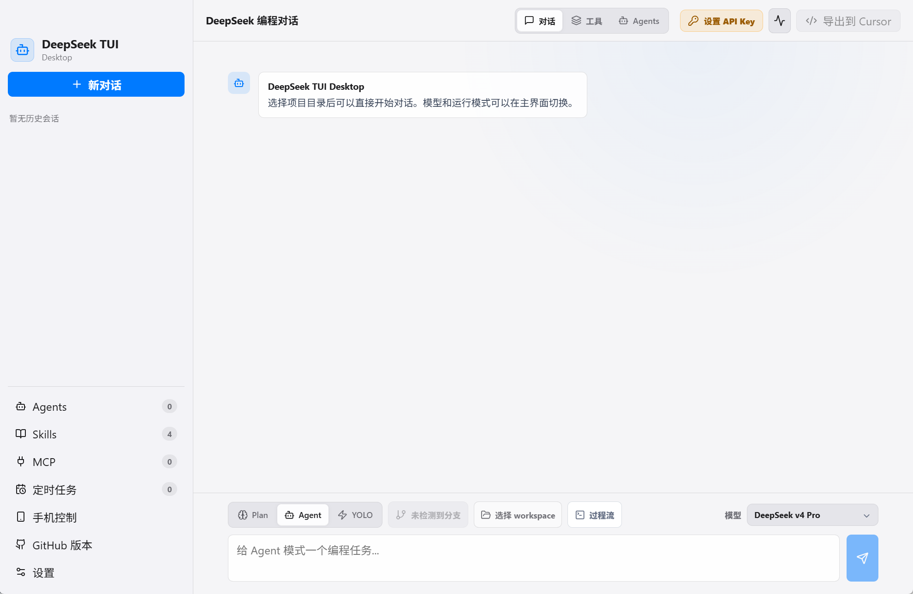
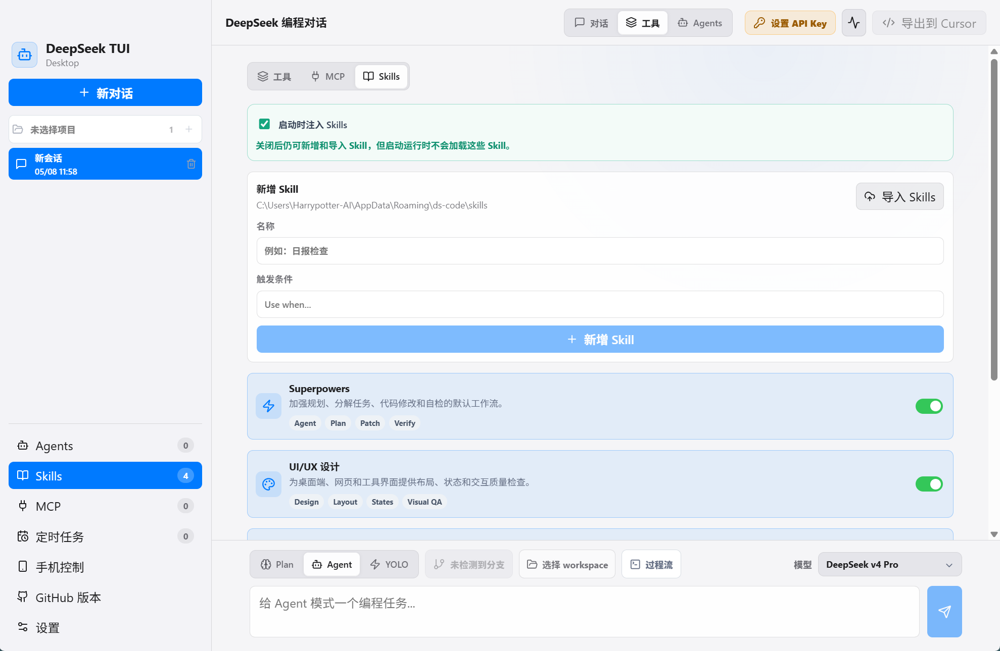
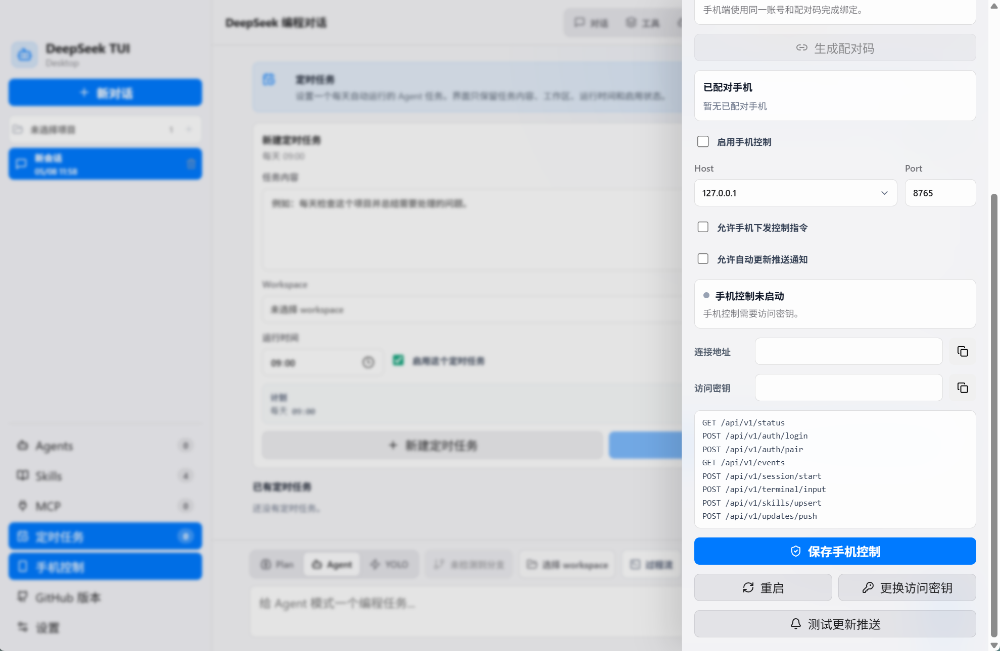

# DeepSeek TUI Desktop

Desktop harness for the DeepSeek TUI coding agent. The app follows a Codex-style layout: a left conversation sidebar, a right conversation surface, and hidden-on-demand drawers for Skills, MCP, workspace, and runtime settings.

## 为什么采用Tauri构建

没有其他原因：快速、简单

##快速构建

```bash
bun install
bunx tauri build
```

The `deepseek-tui` dependency downloads the `deepseek` binary into `node_modules/deepseek-tui/bin/downloads/`. The app defaults to that bundled runtime, but can also use a system or custom binary.

## DeepSeek Model URLs

The desktop UI exposes four model choices, but the official DeepSeek API model IDs are only `deepseek-v4-pro` and `deepseek-v4-flash`. The `1M` choices use the same API model ID because DeepSeek's official model table lists 1M context as the supported context length for both V4 models.

| UI choice | API model sent to DeepSeek | Official documentation |
| --- | --- | --- |
| DeepSeek v4 Pro | `deepseek-v4-pro` | https://api-docs.deepseek.com/news/news260424#deepseek-v4-pro |
| DeepSeek v4 Pro 1M | `deepseek-v4-pro` | https://api-docs.deepseek.com/quick_start/pricing/#model-details |
| DeepSeek v4 Flash | `deepseek-v4-flash` | https://api-docs.deepseek.com/news/news260424#deepseek-v4-flash |
| DeepSeek v4 Flash 1M | `deepseek-v4-flash` | https://api-docs.deepseek.com/quick_start/pricing/#model-details |

## 桌面端预览
DeepseekTUI的桌面端把所有功能采用熟悉的图形化界面呈现，适合不想长期停留在终端里的日常开发工作流。
<table>
  <tr>
    <td align="center" width="33%"><br><b>主界面</b></td>
    <td align="center" width="33%"><br><b>技能面板</b></td>
    <td align="center" width="33%"><br><b>手机控制</b></td>
  </tr>
  </table>
