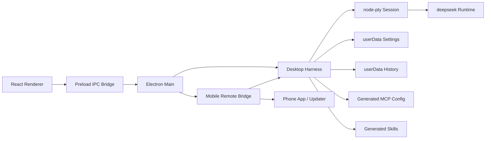

# Harness Architecture Notes

## Upstream Runtime

DeepSeek TUI already owns the hard parts: terminal chat, Plan/Agent/YOLO/RLM/Duo modes, file tools, shell tools, MCP, skills, sessions, sub-agents, and approval behavior. This desktop app should not fork that agent loop until upstream exposes a stable structured API.

The desktop app runs the upstream `deepseek` executable through a local harness in a PTY. That keeps terminal semantics intact and leaves Agent/MCP behavior inside the tool that already implements it.

## Harness Model

- Renderer is a client only. It renders the conversation UI, project-grouped history sidebar, hidden drawers, and terminal output.
- The renderer now has three main modes: `对话` for chat, `工具` for graphical MCP/Skills status, and `终端` for focused runtime output.
- Preload bridge is the narrow IPC boundary.
- `electron/harness.cjs` is the local execution harness. It resolves the `deepseek` binary, normalizes the workspace, builds launch plans, applies env policy, starts/stops PTY sessions, and emits terminal events.
- Electron main owns windows and dialogs, then delegates runtime work to the harness.
- PTY output streams to xterm.js; keyboard input streams back through the harness.
- Settings are saved under Electron `userData`, but API keys are not persisted.
- Conversation history is saved under Electron `userData/history.json` as projects with nested sessions; terminal output and API keys are not stored in that history file.
- Skills are materialized as local `*/SKILL.md` directories under Electron `userData/skills` or a custom skills root. Presets, user-created skills, imported external skills, and remote-submitted skills share the same directory contract.
- Enabled MCP presets are materialized as `mcp.presets.json` under Electron `userData`, then exposed to the runtime as `DEEPSEEK_MCP_CONFIG`.
- The desktop composer mirrors the upstream mode names as `Plan / Agent / YOLO`. Plan prompts still use a non-mutating plan-only prefix for one-shot runs, while YOLO launches the upstream CLI with `--yolo`.
- Optional mobile bridge lives in Electron main and wraps the harness with token-protected HTTP/SSE endpoints. It can stream progress to a phone app, accept remote control commands when explicitly enabled, receive generated Skill drafts from a phone/voice client, emit update push notifications, and maintain a local login/device-pairing registry for matching desktop and phone clients.

## Packaging

The npm `deepseek-tui` package downloads GitHub release binaries during `postinstall`. Electron Builder packages `node_modules/deepseek-tui/bin/downloads/**` outside `app.asar` so the installed app can execute the bundled runtime.

Windows test packaging runs `scripts/prepare-win-runtime.cjs` before Electron Builder. This matters for cross-building from macOS because the upstream npm postinstall only downloads the current platform's binary. The preflight script downloads and SHA256-verifies the Windows x64 `deepseek.exe` and `deepseek-tui.exe` assets into the same `node_modules/deepseek-tui/bin/downloads/` directory that the harness resolves at runtime.

`node-pty` is also unpacked because it contains a native module.

Windows x64 installers use NSIS. Local tester builds can be signed with the generated self-signed PFX under `build/certs/`; the PFX is ignored by git and is not suitable for public distribution.

## Known Constraints

- The app currently assumes the upstream CLI command grammar. If a command changes, the launch builder in `electron/harness.cjs` is the single integration point to update.
- MCP configuration is passed through `DEEPSEEK_MCP_CONFIG`; the desktop UI now toggles popular presets and shows startup commands, auth hints, categories, and npm download metadata, but does not yet expose a full JSON editor or per-server connection test.
- Token-based MCP presets rely on environment variables such as `GITHUB_PERSONAL_ACCESS_TOKEN`, `NOTION_TOKEN`, `SLACK_BOT_TOKEN`, `STRIPE_SECRET_KEY`, and `PANEL_ACCESS_TOKEN`.
- The mobile bridge is a local/LAN interface, not a cloud relay. Remote access outside the LAN still needs a relay, tunnel, or native push provider layer.
- The login service is local-first: it records the desktop account id, paired phone devices, and device-token hashes under Electron `userData`. A production push service can reuse the same account/device contract behind a cloud relay.
- Unsigned or locally self-signed packages are suitable for local testing only. Public distribution needs Developer ID signing/notarization on macOS and a trusted Windows code-signing certificate.
